# Maliza


## 1) Screenshots

- **Login, Register**

<p align="center">
    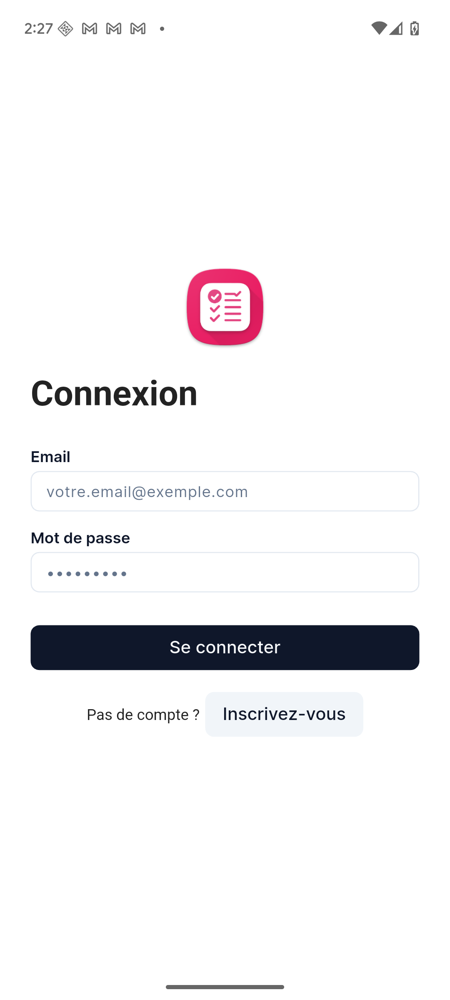
    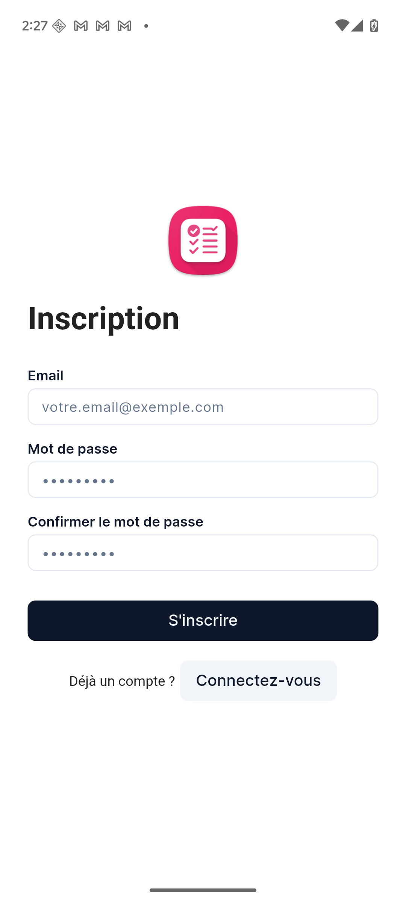
</p>

- **Accueil (météo + liste + profil + logout)**

<p align="center">
    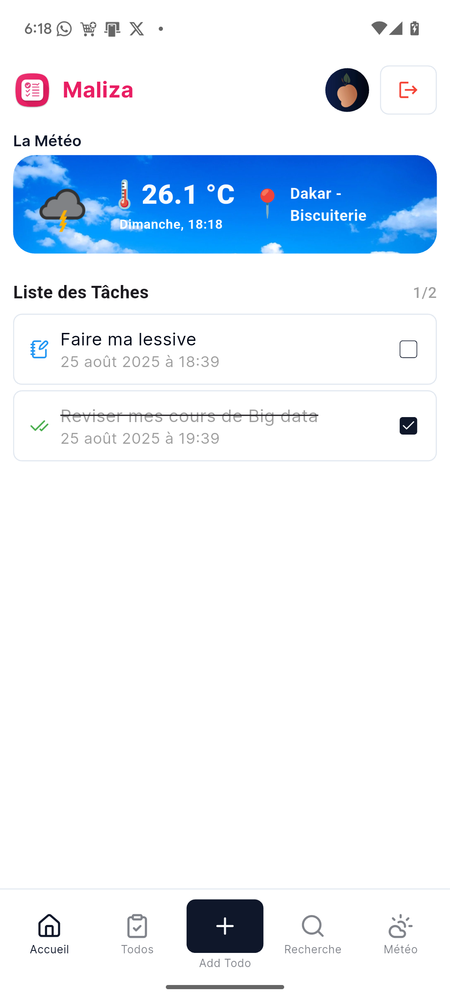
</p>

- **Ajout/édition/complétion/suppression d’une tâche (avec Slidable)**

<p align="center">
    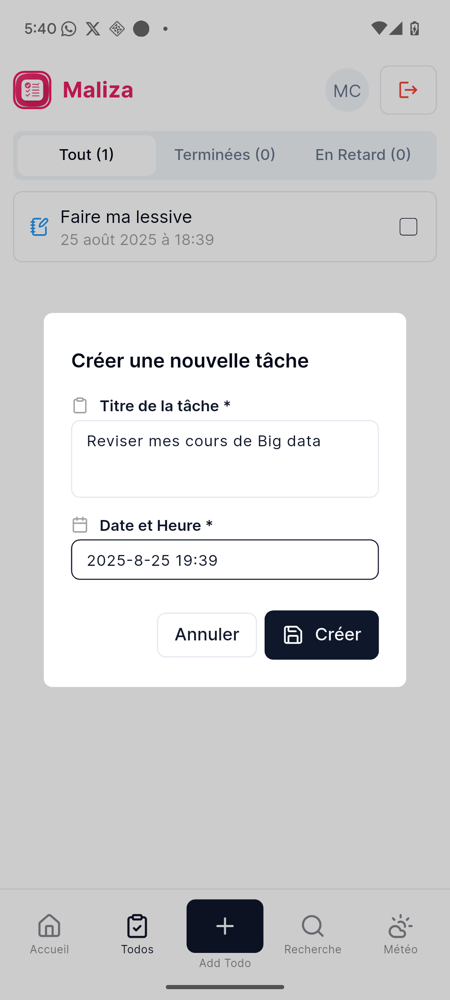
    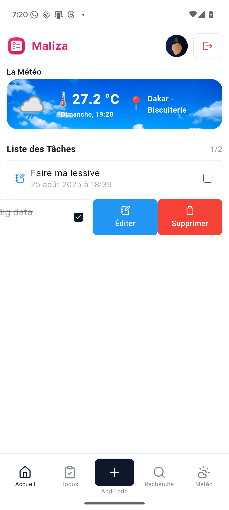
</p>

- **Recherche**

<p align="center">
    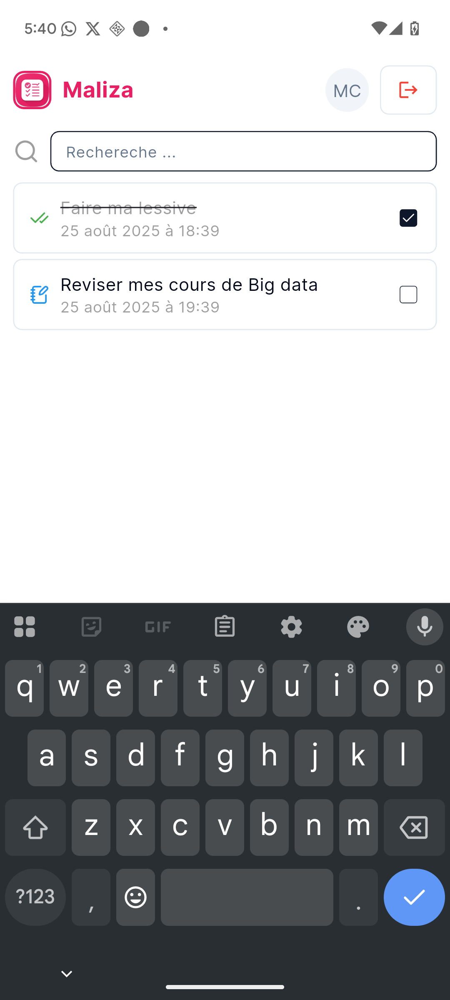
</p>

- **Profil (sélection photo)**

<p align="center">
    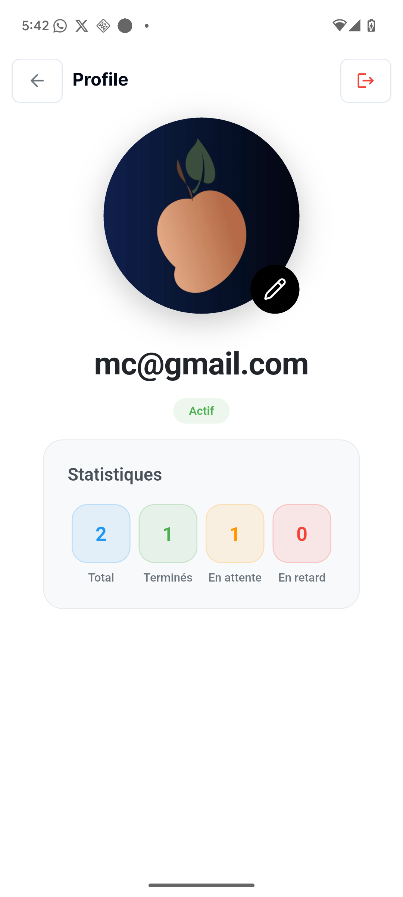
</p>

- **Historique**

<p align="center">
    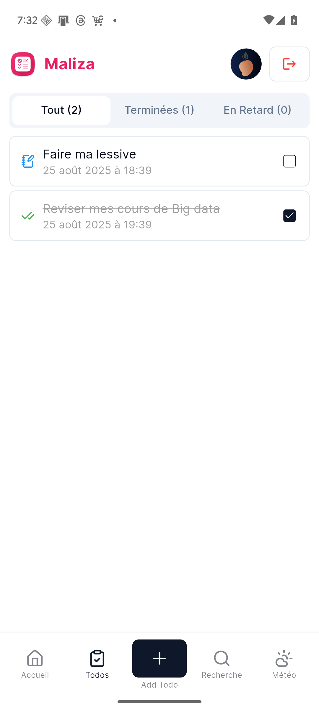
    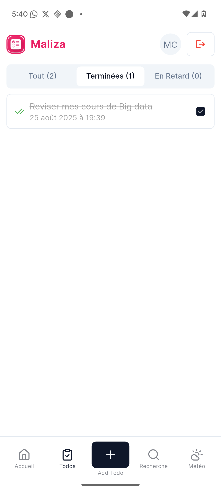
    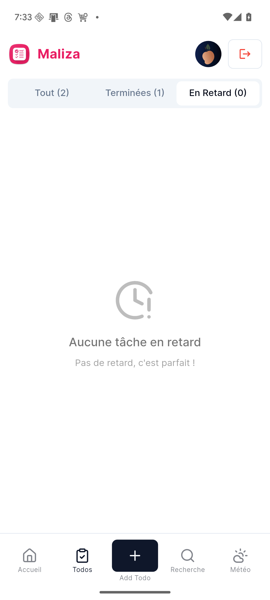
</p>

- **Météo**

<p align="center">
    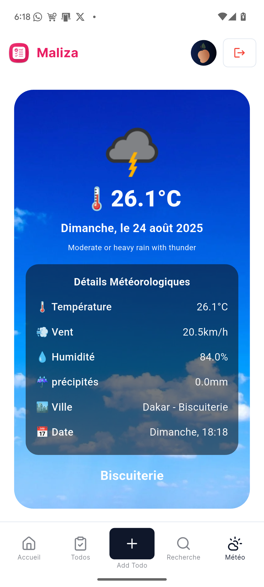
    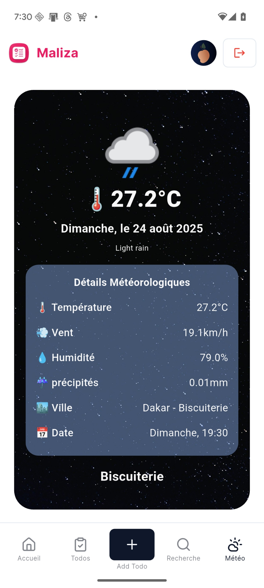
</p>

---

## 2) Structure du projet

Organisation logique en trois grands blocs :

- **`lib/core/`** : fondations techniques partagées (API, configuration, erreurs, modèles, réseau, thème, routes, widgets génériques).
- **`lib/features/`** : fonctionnalités applicatives (authentification, cœur de l’app).
- **`assets/`** : ressources statiques (images, icônes).

Aperçu des dossiers clés :

```yaml
lib/
  core/
    api/
      api_endpoints.dart        # URLs de l’API
      remote_database_helper.dart
      remote_db_updater.dart    # Logique de synchronisation
      weather_service.dart      # Intégration WeatherAPI
    config/
      config_global.dart        # Nom app, version, IP serveur API
    data/
      account_cache.dart        # Session & préférences (SharedPreferences)
      database_helper.dart      # SQLite (tables todo, todo_action, profile)
    error/                      # Exceptions API/Réseau/Météo
    models/                     # Todo, User, ApiResult, SyncResult, etc.
    network/
      network_client.dart       # Client HTTP + gestion d’erreurs
    routes/
      app_routes.dart           # Noms des routes
      app_router.dart           # Générateur de routes
    theme/
      theme_config.dart         # Thème ForUI

  features/
    auth/
      provider/auth_provider.dart
      presentation/pages/login_page.dart
      presentation/pages/registration_page.dart
    app/
      provider/                 # TaskProvider, WeatherProvider, ProfileProvider, ...
      presentation/
        pages/                  # HomePage, TodoPage, ProfilePage, RecherchePage, App
        widget/                 # Weather, TaskListWidget, TopBar, dialogs, LogoutBtn
        bloc/                   # AddTaskBloc, ListTodos (UI blocs)

  main.dart                     # Point d’entrée
